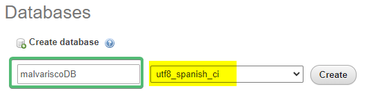
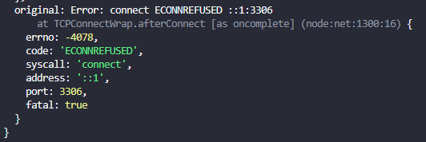
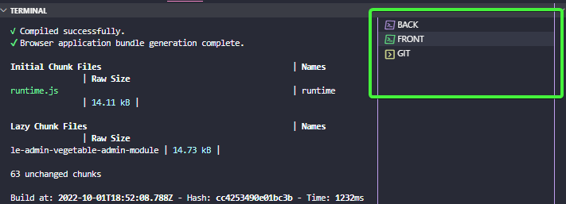
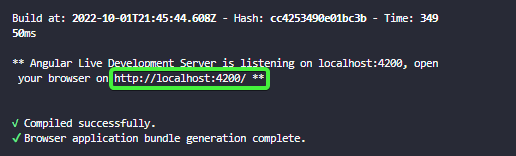
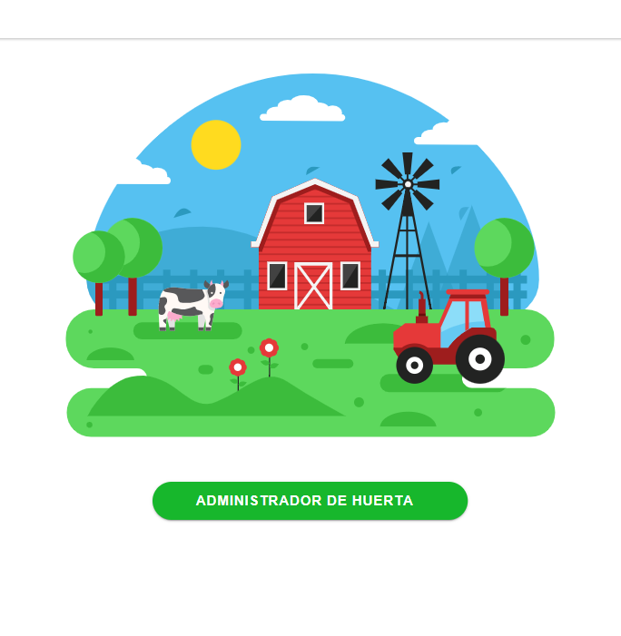
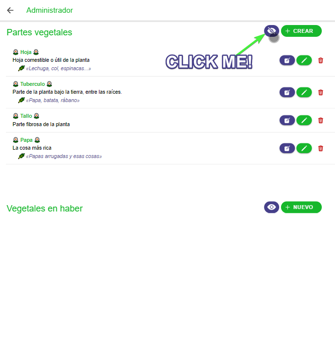

# Malva-Risco Adminpage

Web admin for _Malva-Risco farm_, in Tenerife island. 💚

## 0. Roadmap

- ✅ Getting started: (20%)
  - ✅ Upload your project to GitHub (1/20 %)
  - ✅ Write a README.md (1/20 %)
  - ✅ Add your postman documentation in the readme. (2/20 %)
  - ✅ Postman - GET. (2/20 %)
  - ✅ Postman - POST. (2/20 %)
  - ✅ Postman - DELETE. (2/20 %)
  - ✅ Postman - PUT. (2/20 %)
  - ✅ Ionic - GET. (2/20 %)
  - ✅ Ionic - POST. (2/20 %)
  - ✅ Ionic - DELETE. (2/20 %)
  - ✅ Ionic - PUT. (2/20 %)
- ⬜ Frontend (20%)
  - ✅ Component 1 - [Ion-content](https://ionicframework.com/docs/api/content)  (2/20 %)
  - ✅ Component 2 - [Ion-toolbar](https://ionicframework.com/docs/api/toolbar) (2/20 %)
  - ✅ Component 3 - [Ion-button](https://ionicframework.com/docs/api/button) (2/20 %)
  - ✅ Component 4 - [Ion-back-button](https://ionicframework.com/docs/api/back-button) (2/20 %)
  - ✅ Component 5 - [Ion-icon](https://ionic.io/ionicons) (2/20 %)
  - ✅ Component 6 - [Ion-list](https://ionicframework.com/docs/api/list) (2/20 %)
  - ✅ Component 7 - [Ionic Alert](https://ionicframework.com/docs/api/alert) (2/20 %)
  - ⬜ Component 8 (2/20 %)
  - ⬜ Component 9 (2/20 %)
  - ⬜ Component 10 (2/20 %)
- ⬜ Photos (10%)
  - ⬜ Take photos with device's camera. (5/10 %)
  - ⬜ Handle photos from frontend (CRUD). (2,5/10 %)
  - ✅ Store the photo in the backend (CRUD). (2,5/10 %)
- ⬜ Auth (10%)
  - ⬜ Implement basic authentication (10/10 %)

## 🏃🏻‍♀️ 1. Getting Started

These instructions will get you a copy of the project up and running on your local machine for development and testing purposes.

👁‍🗨 See **deployment** for notes on how to deploy the project on a live system.

### 🏃🏻‍♀️📝 1.1 Prerequisites and installing

1️⃣ If you haven't Git installed in your local machine, I hardly encorage you to install it. Then you could clone the whole repository.

```bash
git clone 'path'
```

2️⃣ You will need Node >16.13.0 to run the server either in the backend (api to database) as in the frontend (web).

If you are a window user, you should download it at [nodejs.org](https://nodejs.org/es/download/).

If, instead, you are a linux user, you would download it from terminal.

```bash
apk add nodejs npm
```

Finally, if you are an IOS user, you can buy it in the app-store. 🤡

Sorry, it's a bad joke. You can download it at [nodejs.org](https://nodejs.org/es/download/), like any other window user.

3️⃣ It's not mandatory to install Angular Cli globally, but you will need it at least in the project.

>Install globally:

```powershell
npm i -g @angular/cli
```

>Install locally:

```powershell
cd frontend/
npm i @angular/cli
```

4️⃣ Install ionic

```powershell
npm install -g @ionic/cli
```

5️⃣ Create an local database

You can use [wamp](https://www.wampserver.com/en/), [xampp](https://www.apachefriends.org/es/index.html), or whatever tool of your preference.

❗❗ Your database must be named **'malvariscoDB'** in order to be recognized by the backend.

If you are going to enter data in spanish, I recomend you to use utf8_spanish_ci in ordert to save text with "ñ".



6️⃣ Make a new file inside the backend directory called db.config.js:

```powershell
new-item ./backend/config/db.config.js
```

If you are using Visual Studio Code, you can create and edit the file at once writing in your terminal:

```powershell
code ./backend/config/db.config.js
```

7️⃣ Inside the file include the following info:

```js
module.exports = {
    HOST: 'localhost',
    USER: 'userName', //❗❗ Fill it with your database user
    PASSWORD: 'userPassword', //❗❗ Fill it with your database user password
    DB: 'malvariscoDB', //❗❗ If you prefer to change your database name, then you must change it here too.
    dialect: 'mysql',
    pool: {
        max: 5,
        min: 0,
        acquire: 30000,
        idle: 10000,
    }
};
```

8️⃣ Init node in the backend

```powershell
cd backend/
npm install
```

9️⃣ Init node in the frontend

```powershell
cd ../frontend/
npm install
```

### 🏃🏻‍♀️🔧 1.2 Testing the API

You can test the backend is running, and the API is live with Postman.

[](https://app.getpostman.com/run-collection/23242060-77d96949-b2cc-4a6d-bd2e-68eca7c5c715?action=collection%2Ffork&collection-url=entityId%3D23242060-77d96949-b2cc-4a6d-bd2e-68eca7c5c715%26entityType%3Dcollection%26workspaceId%3Df0ac5b98-26b0-4d2f-8b6e-b3cc58c39e87)

[Link to the API documentation](https://documenter.getpostman.com/view/23242060/2s83ziMiKG)

## 🚚 3. Deployment

Now, I'm sure you want to see the webpage by your own.

First, we are going to raise the API:

If it's first time running the project, you need to set the development mode in order to create the database tables.

❗❗ Whenever you need to drop the database data, repeat this step. Avoid if you **do not want** to lose your data.

```powershell
cd ./backend/ # <= if you are in root directory
npm start devmode # <= if this is your fist time running the project or you want to drop your data.
```

Next time you want to run the database server:

```powershell
cd ./backend/ # <= if you are in root directory
npm start
```

If you terminal print an error like this:



Maybe you haven't run your db server. So, if you are using Wamp Server, Xamp or whatever tool of your preference, run it.

‼️ If you want to stop the backend, you must press "ctrl + c" in the terminal.

Now you will need to run the frontend. To do this, you will need other terminal. If you are using Visual Studio Code, you can have as much as you want, and named it to identify it clearly.

Example:



Now, in your frontend terminal you have to run the frontend:

```powershell
cd ./frontend/ # <= if you are in root directory
npm start
```

There is it. You have had to wait a little bit, but it will be done finally, and in the terminal you will see the port where your website will be running.



Go on and try it out in your preferred web browser:



In order to see the data you need to click over the eye icon.



## 🚧 4. Built With

* [Ionic](https://ionicframework.com/) - SDK
* [Angular](https://angular.io/) - FrontEnd Framework
* [Express](https://expressjs.com/) - BackEnd Framework
* [Sequelize](https://sequelize.org/) - ORM
* [MySQL](https://www.mysql.com/) - BD

**Frontpage image**: [Farm Vectores, by Vecteezy](https://es.vecteezy.com/vectores-gratis/farm).

## 👩🏻‍🌾 7. Authors

* **Iremaru** - _Initial work_ - [GitHub](https://github.com/iremaru)

## 📃 8. License

This project is licensed under the MIT License.

## 🧾 9. Acknowledgments

* This project is the result of "Multimedia and Mobile development" subject's activity, as part of DAM course (_Cross-platform development training course_) given by Tiburcio Cruz, aka [Tcrurav](https://github.com/tcrurav) from [I.E.S. El Rincón](ieselrincon.org/), in [Canary Islands](https://en.wikipedia.org/wiki/Canary_Islands).
* This project was inpired by my **mom's vegetable garden, 💚Malva-risco💚** and her needs for an admin system.
